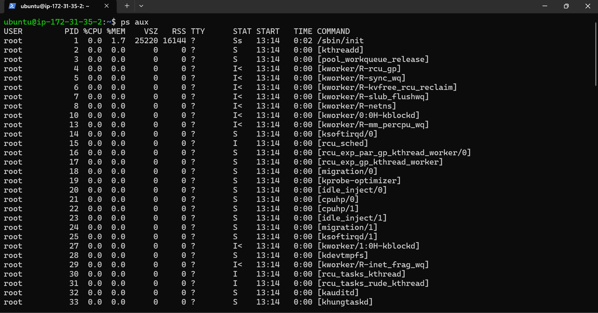
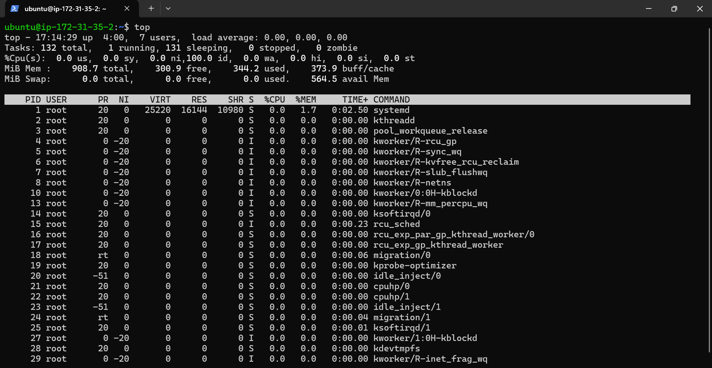
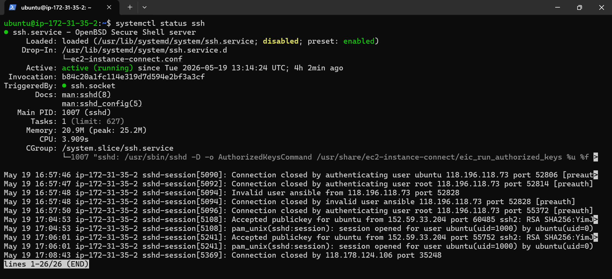
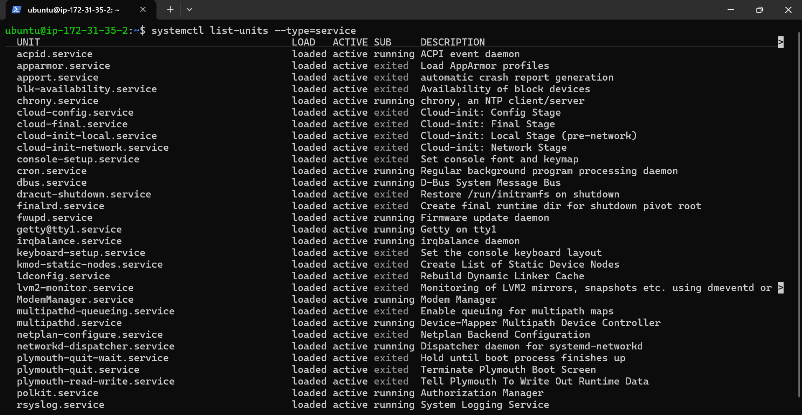
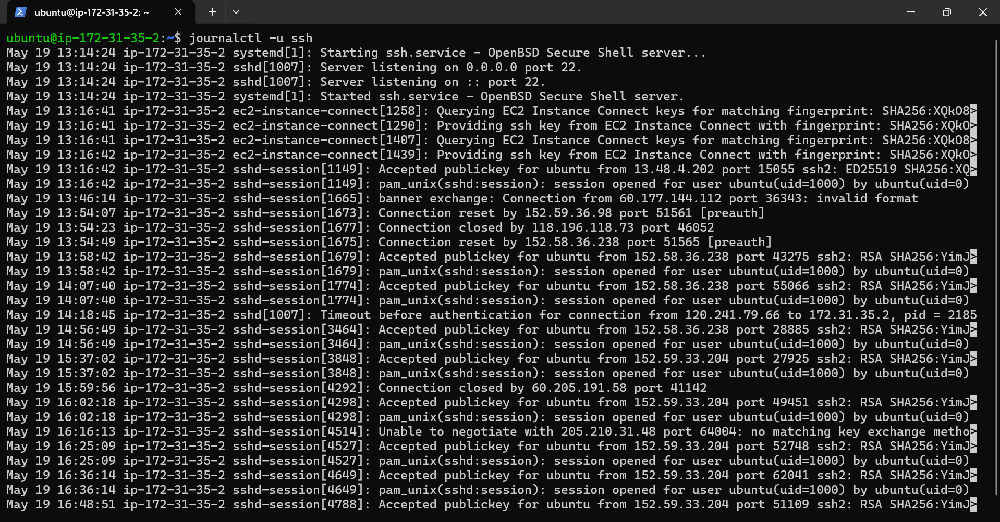
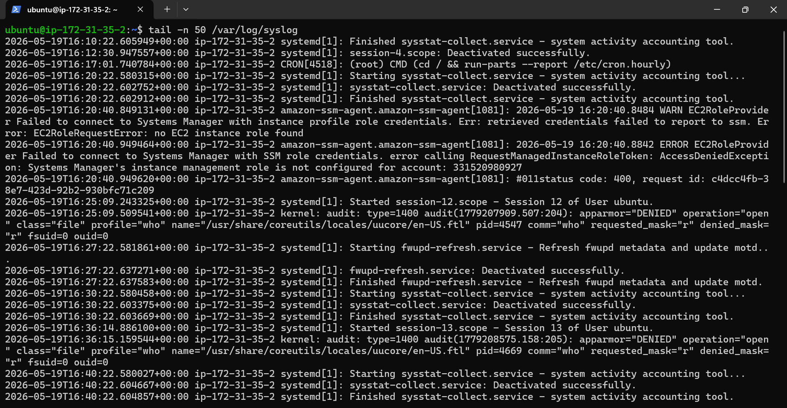

# Linux Practice - Processes and Services

## Process Checks

### Process Command 1 

Shows all running processes in the system.

Command:
ps aux

Run:

### Process Command 2

Displays live CPU and memory usage.

Command:
top

Run:

## Service Checks

### Service Command 1

Used to inspect whether SSH service is active or not.

Command:
systemctl status ssh

Run:

### Service Command 2

Shows all active services running on the system.

Command:
systemctl list-units --type=service

Run:

## Log Checks

### Log Command 1

Displays logs related to SSH service.

Command:
journalctl -u ssh

Run :

### Log Command 2

Shows the latest 50 lines from system logs.

Command:
tail -n 50 /var/log/syslog

Run:

## Mini Troubleshooting

### Problem

SSH service was not responding properly.

### Steps Performed
1. Checked running processes using "ps aux"
2. Verified SSH service status using "systemctl status ssh"
3. Reviewed logs using "journalctl -u ssh"
4. Confirmed service was active and running
### Learning

Learned how to inspect processes, services, and logs in Linux.