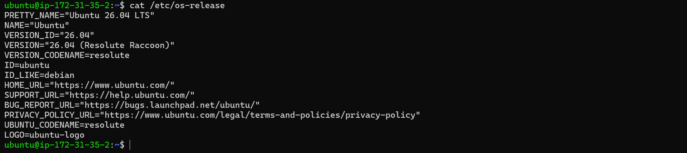
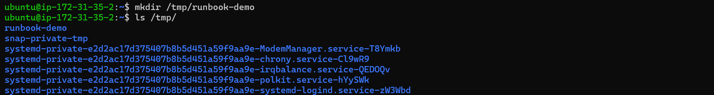
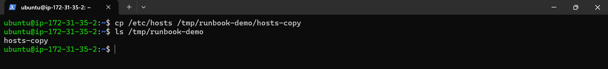
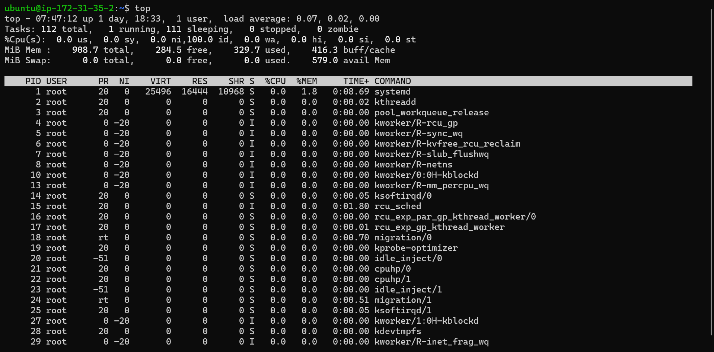
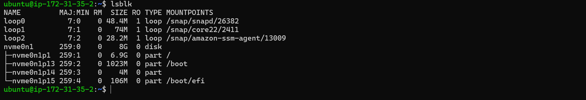
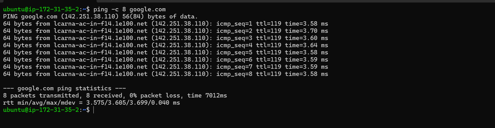
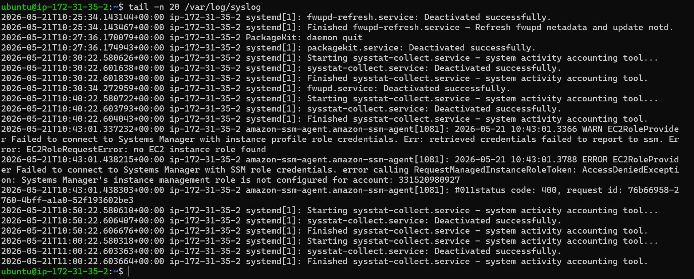

# Troubleshoot Runbook for ssh service

## Environment Basics

### Command 1:

It is mainly used to check Linux system information.

Command:

uname -a

Output:

Observation: 

The uname -a command successfully displayed Linux kernel and AWS Ubuntu system information. The command executed properly and terminal returned to normal prompt, indicating the EC2 Ubuntu instance is running correctly.

### Command 2:

This command displays Ubuntu operating system details.

Command:

cat /etc/os-release

Output:

Observation: 

The cat /etc/os-release command successfully displayed Ubuntu operating system details including version, codename, and distribution information. The output confirms the EC2 instance is running Ubuntu 26.04 LTS correctly.

## Filesystem sanity

### Command 1:

This command creates a temporary folder.

Command:

mkdir /tmp/runbook-demo

Output:

Observation: 

The mkdir /tmp/runbook-demo command created Temporary folder successfully.

### Command 2:

This command copies a file and checks whether it exists in the folder.

Command:

cp /etc/hosts /tmp/runbook-demo/hosts-copy
ls /tmp/runbook-demo

Output:

Observation: 

The cp command successfully copied the /etc/hosts file into the runbook-demo directory with the name hosts-copy. The ls command verified the copied file exists in the destination folder.

## CPU & Memory

### Command 1:

This command shows live CPU and memory usage.

Command:

top

Output:

| Section   | Meaning                          |
| --------- | -------------------------------- |
| `Tasks`   | total running/sleeping processes |
| `%Cpu(s)` | CPU usage details                |
| `MiB Mem` | RAM usage                        |
| `PID`     | process ID                       |
| `%CPU`    | CPU used by process              |
| `%MEM`    | memory used by process           |
| `COMMAND` | process name                     |

Observation:

The top command successfully displayed real-time system monitoring information including CPU usage, memory usage, running tasks, and active Linux processes. The system appears healthy with low CPU usage, available memory, and no zombie processes.

### Command 2:

This command shows RAM and memory usage.

Command:

free -h 

-h means human-readable format (MB/GB easier to read).

Output:

Observation: 

The free -h command successfully displayed RAM and memory usage information of the Ubuntu EC2 instance. The system has sufficient available memory and is running in a healthy state without memory overload.

## Disk & Storage

### Command 1:

This command checks disk storage usage.

Command:

df -h

Output:

Observation: 

The df -h command successfully displayed disk and filesystem usage information of the Ubuntu EC2 instance. The root partition has sufficient free storage available and the system storage usage is healthy at 35%.

### Command 2:

This command shows disk and storage devices attached to the system.

Command:

lsblk

Output:

Observation: 

The lsblk command successfully displayed block storage devices and partitions of the Ubuntu EC2 instance. The main NVMe disk and its root, boot, and EFI partitions are properly mounted and functioning correctly.

## Network Checks

### Command 1:

This command shows active network ports and services.

Command:

ss -tulpn

Output:

Explanation :

ss stands for socket statistics

| Option | Meaning                |
| ------ | ---------------------- |
| `-t`   | TCP connections        |
| `-u`   | UDP connections        |
| `-l`   | Listening ports        |
| `-p`   | Process using port     |
| `-n`   | Show numeric ports/IPs |

It is a modern replacement for netstat

TCP (Transmission Control Protocol) and UDP (User Datagram Protocol) are the two core transport-layer protocols in Linux used to send data across networks. TCP prioritizes reliability and order (slower), while UDP prioritizes speed and efficiency (faster).

| State    | Meaning                         |
| -------- | ------------------------------- |
| `LISTEN` | service waiting for connections |
| `UNCONN` | UDP socket without connection   |

| Port | Service          |
| ---- | ---------------- |
| `22` | SSH remote login |

Observation: 

The ss -tulpn command successfully displayed active TCP and UDP listening ports of the Ubuntu EC2 instance. SSH service was actively listening on port 22, confirming successful remote access and healthy network services.

### Command 2:

This command checks internet connectivity.

Command:

ping -c 8 google.com

Output:

Observation: 

The ping -c 8 google.com command successfully tested internet connectivity from the Ubuntu EC2 instance. All 8 packets were transmitted and received with 0% packet loss and low response time, indicating healthy network and DNS connectivity.

## Logs Checks

### Command 1:

This command displays recent SSH service logs.

Command:

journalctl -u ssh -n 20

Output:

Observation: 

The journalctl -u ssh -n 20 command successfully displayed recent SSH service logs of the Ubuntu EC2 instance. The logs confirmed successful public key authentication for the ubuntu user and showed that invalid login attempts from external IP addresses were correctly rejected by the SSH service.

### Command 2:

This command shows the latest system logs.

Command:

tail -n 20 /var/log/syslog

Output:

Observation: 

The tail -n 20 /var/log/syslog command successfully displayed the latest system log entries of the Ubuntu EC2 instance. System services like sysstat and fwupd completed successfully, while AWS SSM agent logs showed a warning due to missing IAM role configuration for Systems Manager access.

## Quick Findings

- Linux system is running properly
- CPU and memory usage are normal
- Disk storage is healthy
- Internet connection is working
- No major errors found in logs

## If This Worsens

1. Restart the SSH service
2. Monitor logs again
3. Check CPU and memory usage continuously