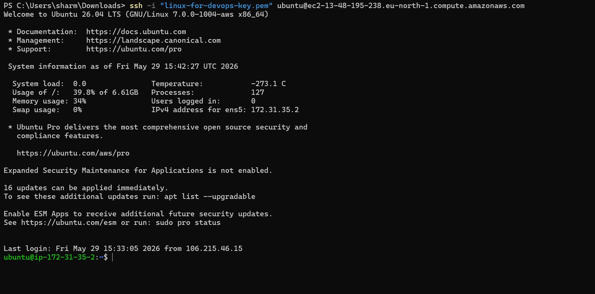
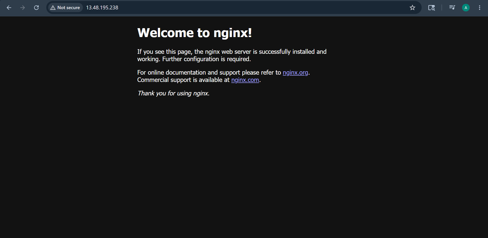
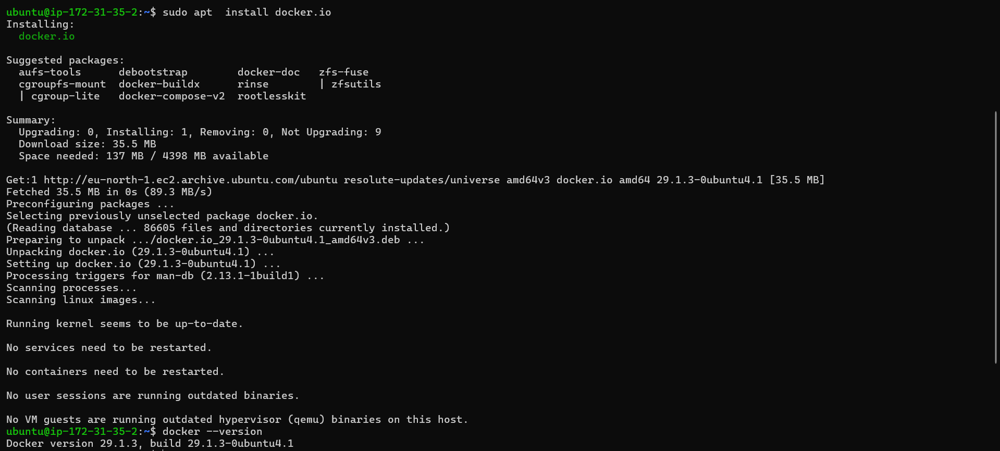
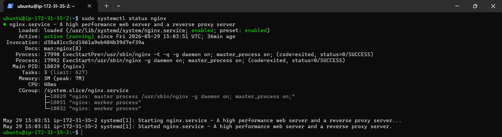

# Day 08 – Cloud Server Setup: Docker, Nginx & Web Deployment

## Objective

The goal of this task was to deploy and manage a cloud-based Linux server using AWS EC2.
I connected to the server through SSH, installed Docker and Nginx, configured security groups for public web access, and explored Nginx logs.

---

# Cloud Platform Used

* AWS EC2
* Ubuntu Linux Server

---

# Commands Used

## Connect to EC2 via SSH

```bash
ssh -i "linux-for-devops-key.pem" ubuntu@ec2-13-48-195-238.eu-north-1.compute.amazonaws.com
```

## Update System

```bash
sudo apt update
sudo apt upgrade -y
```

## Install Docker

```bash
sudo apt install docker.io -y
docker --version
```

## Install Nginx

```bash
sudo apt install nginx -y
```

## Start and Verify Nginx

```bash
sudo systemctl start nginx
sudo systemctl status nginx
```

## View Nginx Logs

```bash
cat /var/log/nginx/access.log
```

## Save Logs into File

```bash
cp /var/log/nginx/access.log ~/nginx-logs.txt
```

## Download Logs to Local Machine

```bash
scp -i "linux-for-devops-key.pem" ubuntu@ec2-13-48-195-238.eu-north-1.compute.amazonaws.com:~/nginx-logs.txt .
```

---

# Security Group Configuration

I configured the AWS EC2 Security Group by opening:

* Port 22 for SSH access
* Port 80 for HTTP web access

This allowed the Nginx webpage to become accessible publicly from the browser.

---

# Challenges Faced

## 1. Security Group Issue

Initially the Nginx webpage was not opening because HTTP Port 80 was not enabled in the EC2 Security Group.

### Solution

Added an inbound rule for:

* HTTP
* Port 80
* Anywhere IPv4

---

## 2. SCP Command Error

While downloading the log file, the SCP command failed because the server path syntax was incorrect.

### Solution

Used the correct SCP syntax with `:` after the server address.

---

# What I Learned

* How to launch and manage cloud servers using AWS EC2
* How to connect securely using SSH
* Installing and managing services in Linux
* Importance of Security Groups and firewall ports
* Hosting a website using Nginx
* Viewing and managing server logs
* Basic usage of Docker
* Transferring files using SCP

---

# Output Verification

Successfully completed:

* SSH connection to EC2
* Docker installation
* Nginx installation
* Public Nginx webpage deployment
* Log extraction and download

---

# Screenshots Added

 ## ssh-connection.png



 ## nginx-webpage.png



 ## docker.png



## nginx.png



---

# Conclusion

This task provided practical exposure to real-world DevOps concepts including cloud infrastructure, server management, web hosting, logging, and security configuration using AWS EC2 and Linux.
