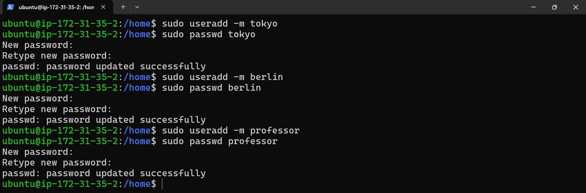
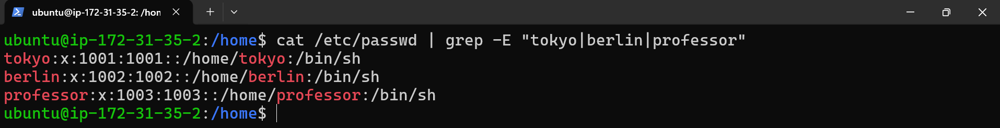
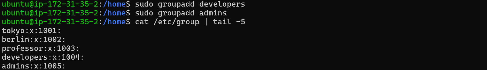
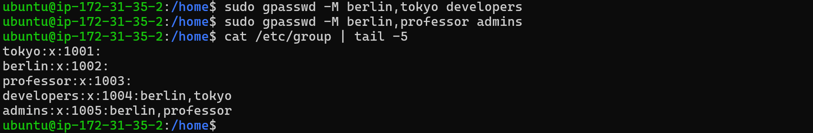
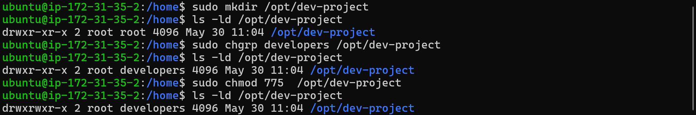
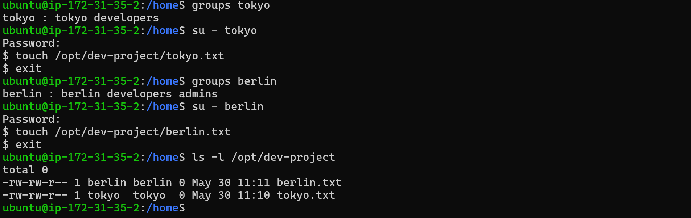
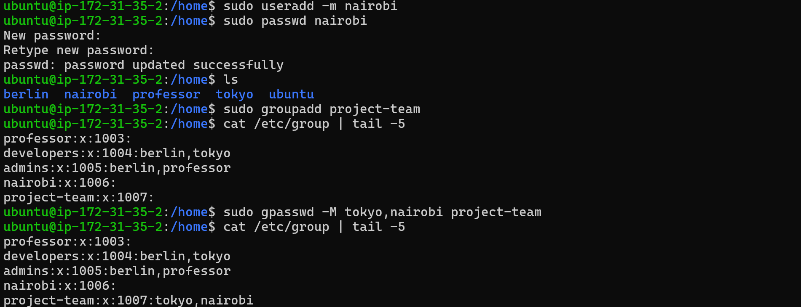
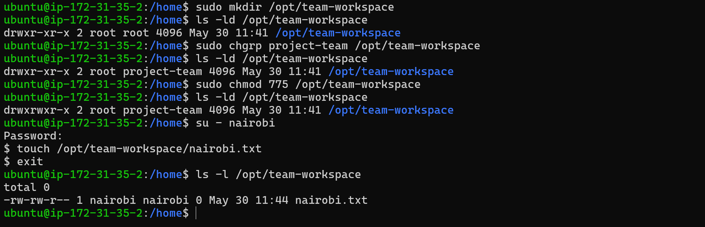

# Day 09 - Linux User & Group Management Challenge

## Task 1: Create Users

### Objective

Create three users with home directories and passwords.

### Commands Used

```bash
sudo useradd -m tokyo
sudo passwd tokyo

sudo useradd -m berlin
sudo passwd berlin

sudo useradd -m professor
sudo passwd professor
```

### Verification

```bash
cat /etc/passwd | grep -E "tokyo|berlin|professor"
```





### Observation

* Successfully created three users.
* Home directories were created in `/home`.

---

## Task 2: Create Groups

### Objective

Create two groups: developers and admins.

### Commands Used

```bash
sudo groupadd developers
sudo groupadd admins
```

### Verification

```bash
cat /etc/group | tail -5
```




### Observation

* Successfully created developers and admins groups.

---

## Task 3: Assign Users to Groups

### Objective

Assign users to appropriate groups.

### Commands Used

```bash
sudo gpasswd -M berlin,tokyo developers
sudo gpasswd -M berlin,professor admins
```

### Verification

```bash
cat /etc/group | tail -5
```




### Observation

* tokyo added to developers group.
* berlin added to developers and admins groups.
* professor added to admins group.

---

## Task 4: Shared Directory for Developers

### Objective

Create a shared project directory for developers.

### Step 1: Create Directory

```bash
sudo mkdir /opt/dev-project
```

### Step 2: Assign Group

```bash
sudo chgrp developers /opt/dev-project
```

### Step 3: Set Permissions

```bash
sudo chmod 775 /opt/dev-project
```

### Verification

```bash
ls -ld /opt/dev-project
```


### Test Access

Switch to tokyo user:

```bash
su - tokyo
touch /opt/dev-project/tokyo.txt
exit
```

Switch to berlin user:

```bash
su - berlin
touch /opt/dev-project/berlin.txt
exit
```

### Final Verification

```bash
ls -l /opt/dev-project
```



### Observation

* Both tokyo and berlin were able to create files.
* Shared directory permissions worked successfully.

---

## Task 5: Team Workspace

### Objective

Create a separate workspace for a project team.

### Step 1: Create User

```bash
sudo useradd -m nairobi
sudo passwd nairobi
```

### Step 2: Create Group

```bash
sudo groupadd project-team
```

### Step 3: Add Users to Group

```bash
sudo gpasswd -M tokyo,nairobi project-team
```

### Verification

```bash
cat /etc/group | tail -5
```


### Step 4: Create Team Workspace

```bash
sudo mkdir /opt/team-workspace
```

### Step 5: Assign Group

```bash
sudo chgrp project-team /opt/team-workspace
```

### Step 6: Set Permissions

```bash
sudo chmod 775 /opt/team-workspace
```

### Verification

```bash
ls -ld /opt/team-workspace
```

### Test Access

```bash
su - nairobi
touch /opt/team-workspace/nairobi.txt
exit
```

### Final Verification

```bash
ls -l /opt/team-workspace
```


### Observation

* Nairobi successfully created a file inside the team workspace.
* Group-based access control worked correctly.

---

# What I Learned

1. How to create Linux users and groups.
2. How to assign users to multiple groups.
3. How Linux permissions work using chmod.
4. How shared directories are managed using groups.
5. How DevOps teams use group-based access control for collaboration.

# Commands Practiced

```bash
useradd
passwd
groupadd
gpasswd
groups
mkdir
chgrp
chmod
ls
touch
su
cat
grep
```
